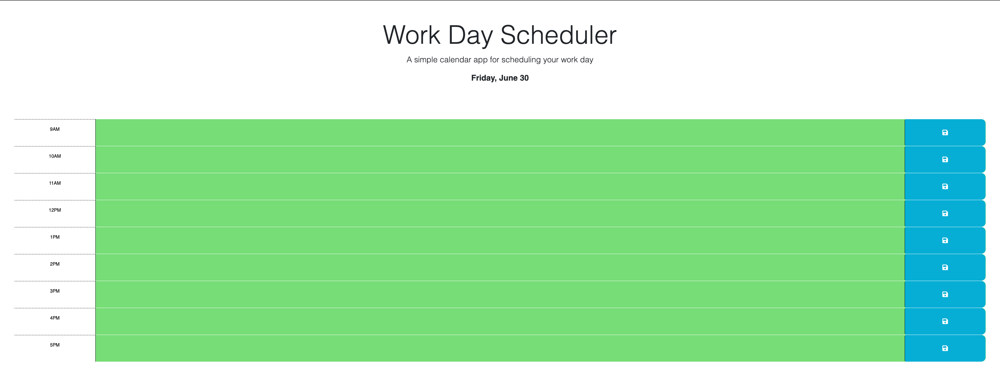

# Work Day Scheduler

## Description

This project showcases a small calendar scheduler for the current day that will allow the user to add an event and save it.

This assignment helped me with the following concepts: 
-Utilizing the jQuery library as opposed to vanilla JavaScript 
-Saving text input to the local storage 
-Using the dayJS library to deal with unique date and time formats. 

## Usage

You can view the scheduler at the following link:

https://shbunch.github.io/work-day-scheduler/

## Credits

SMU Coding Boot Camp

The starter code can be found at the following link:

https://github.com/coding-boot-camp/crispy-octo-meme